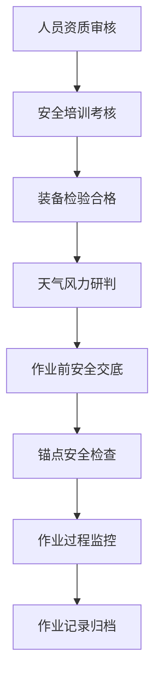

## 1. 产品概述

高空外墙清洗作业管理系统是一款专为"蜘蛛人"作业公司设计的综合管理平台，涵盖项目接单、作业排期、绳索装备管理、安全培训、人员资质、作业记录和结算开票七大核心模块。通过数字化管理提升作业安全性、规范作业流程、提高公司运营效率。

- **目标用户**：高空外墙清洗公司管理者、项目经理、安全监督员、作业人员
- **核心价值**：规范作业流程、强化安全管理、提升运营效率、降低安全风险

## 2. 核心功能

### 2.1 用户角色

| 角色 | 登录方式 | 核心权限 |
|------|----------|----------|
| 系统管理员 | 账号密码登录 | 全部模块管理、用户权限配置、系统设置 |
| 项目经理 | 账号密码登录 | 项目管理、作业排期、人员调度、结算管理 |
| 安全监督员 | 账号密码登录 | 安全培训、资质管理、作业交底、检查记录 |
| 作业人员 | 账号密码登录 | 查看排期、作业记录、个人资质、培训信息 |

### 2.2 功能模块

1. **项目接单**：外墙清洗项目登记、客户信息管理、项目状态跟踪
2. **作业排期**：作业楼栋排期、人员排班、甘特图展示
3. **绳索装备**：绳索安全带台账、装备检验周期、装备报废管理
4. **安全培训**：高处作业培训、培训记录、考核成绩
5. **人员资质**：特种作业证管理、资质有效期提醒、人员档案
6. **作业记录**：作业前安全交底、锚点检查记录、作业进度、天气风力研判、工时统计
7. **结算开票**：工程款结算、发票管理、收款记录

### 2.3 页面详情

| 页面名称 | 模块名称 | 功能描述 |
|---------|---------|----------|
| 仪表盘 | 首页概览 | 关键数据指标、待办事项、项目状态统计、安全预警 |
| 项目列表 | 项目接单 | 项目列表展示、项目登记、项目详情、客户管理 |
| 项目登记 | 项目接单 | 新建项目表单、客户信息、项目参数、合同信息 |
| 作业排期 | 作业排期 | 日历视图、楼栋排期、人员分配、甘特图展示 |
| 装备台账 | 绳索装备 | 装备列表、分类管理、库存统计、检验状态 |
| 装备检验 | 绳索装备 | 检验计划、检验记录、检验周期提醒、报废管理 |
| 培训管理 | 安全培训 | 培训计划、培训记录、考核成绩、培训证书 |
| 人员管理 | 人员资质 | 人员档案、特种作业证、资质有效期、人员状态 |
| 作业记录 | 作业记录 | 安全交底、锚点检查、作业进度、天气风力、工时统计 |
| 结算管理 | 结算开票 | 项目结算、发票管理、收款记录、财务报表 |

## 3. 核心流程

### 3.1 项目作业全流程

项目从接单到结算的完整业务流程：

### 3.2 安全管理流程

安全是高空作业的核心，贯穿整个作业周期：

## 4. 用户界面设计

### 4.1 设计风格

- **主色调**：深海蓝 (#0F4C81) - 代表专业、安全、可靠
- **辅助色**：警示橙 (#FF6B35) - 用于安全提醒和重要操作
- **成功色**：安全绿 (#2ECC71) - 表示合格、正常状态
- **警告色**：警戒红 (#E74C3C) - 表示危险、过期、异常
- **背景色**：浅灰蓝 (#F0F4F8) - 清爽专业的底色

- **按钮风格**：圆角矩形按钮，带有微妙阴影，悬停有轻微上浮效果
- **字体**：系统字体栈，中文使用 "PingFang SC", "Microsoft YaHei"
- **布局风格**：左侧导航栏 + 顶部状态栏 + 主内容区的经典后台管理布局
- **图标风格**：线性图标，简洁明了，统一风格

### 4.2 页面设计概览

| 页面名称 | 模块名称 | UI元素 |
|---------|---------|-------|
| 仪表盘 | 首页概览 | 数据卡片、图表、待办列表、预警提醒、状态统计 |
| 项目列表 | 项目接单 | 搜索筛选、数据表格、状态标签、操作按钮、分页 |
| 作业排期 | 作业排期 | 日历视图、时间轴、人员卡片、拖拽排期、状态颜色 |
| 装备台账 | 绳索装备 | 分类导航、装备卡片、检验进度条、状态指示器 |
| 人员管理 | 人员资质 | 人员头像、资质标签、有效期提醒、证书预览 |
| 作业记录 | 作业记录 | 时间线布局、检查项列表、天气信息、签字确认 |
| 结算管理 | 结算开票 | 金额卡片、发票列表、收款状态、财务图表 |

### 4.3 响应式

- **桌面优先**：以1920x1080为主要设计尺寸
- **平板适配**：侧边栏可收起，内容区自适应
- **关键操作移动端可达**：作业记录、安全检查等现场操作需支持平板设备

### 4.4 交互体验

- 数据表格支持排序、筛选、分页
- 表单有明确的验证反馈
- 重要操作有二次确认
- 状态变化有动画过渡
- 预警信息醒目但不干扰正常操作
