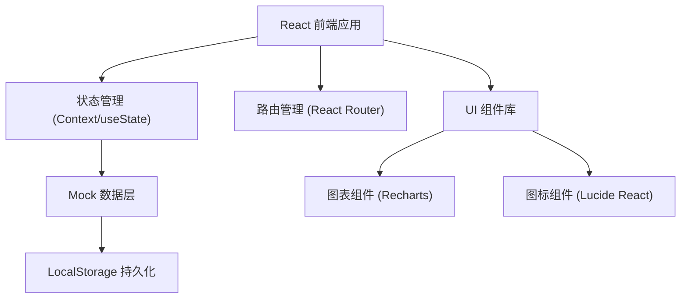
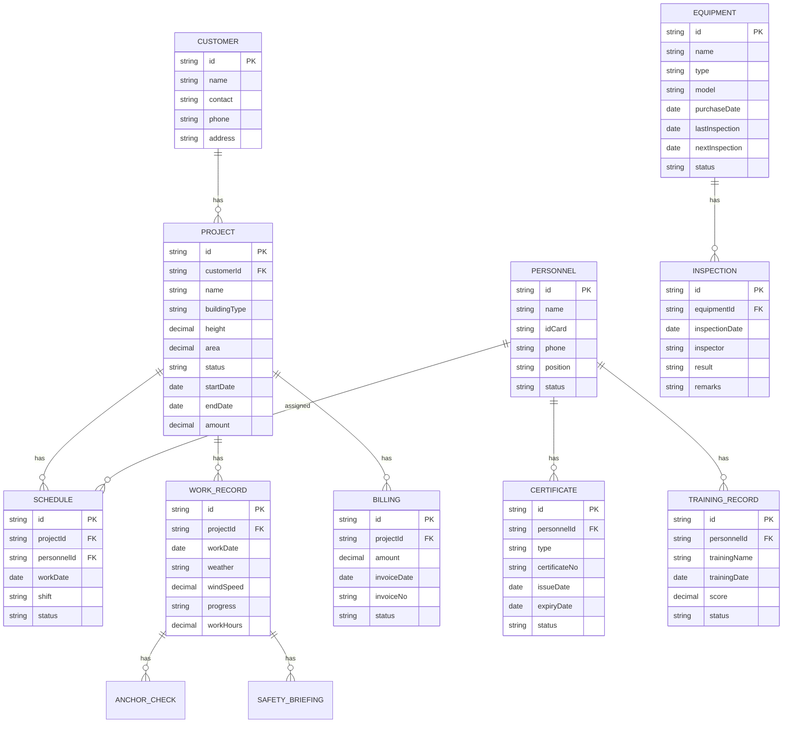

## 1. 架构设计

本系统采用纯前端架构，使用 React + TypeScript 构建单页应用，数据采用 Mock 数据模拟，便于后续接入真实后端 API。



## 2. 技术描述

- **前端框架**：React@18 + TypeScript
- **构建工具**：Vite
- **样式方案**：TailwindCSS@3
- **路由管理**：React Router DOM
- **图表库**：Recharts
- **图标库**：Lucide React
- **状态管理**：React Context + useState
- **数据持久化**：LocalStorage
- **日期处理**：date-fns

## 3. 路由定义

| 路由 | 页面名称 | 模块名称 |
|------|---------|---------|
| /dashboard | 仪表盘 | 首页概览 |
| /projects | 项目列表 | 项目接单 |
| /projects/new | 新建项目 | 项目接单 |
| /projects/:id | 项目详情 | 项目接单 |
| /scheduling | 作业排期 | 作业排期 |
| /equipment | 装备台账 | 绳索装备 |
| /equipment/inspection | 装备检验 | 绳索装备 |
| /training | 培训管理 | 安全培训 |
| /personnel | 人员管理 | 人员资质 |
| /records | 作业记录 | 作业记录 |
| /records/new | 新建作业记录 | 作业记录 |
| /billing | 结算管理 | 结算开票 |
| /customers | 客户管理 | 项目接单 |

## 4. 数据模型

### 4.1 数据模型定义



### 4.2 核心数据类型定义

```typescript
// 项目状态
type ProjectStatus = 'pending' | 'in_progress' | 'completed' | 'cancelled';

// 项目信息
interface Project {
  id: string;
  customerId: string;
  name: string;
  buildingType: string;
  height: number;
  area: number;
  floors: number;
  status: ProjectStatus;
  startDate: string;
  endDate: string;
  amount: number;
  contact: string;
  phone: string;
  address: string;
  remarks: string;
  createdAt: string;
}

// 人员信息
interface Personnel {
  id: string;
  name: string;
  idCard: string;
  phone: string;
  position: string;
  status: 'active' | 'inactive' | 'leave';
  hireDate: string;
  avatar?: string;
}

// 资质证书
interface Certificate {
  id: string;
  personnelId: string;
  type: string;
  certificateNo: string;
  issueDate: string;
  expiryDate: string;
  status: 'valid' | 'expiring' | 'expired';
  issueAuthority: string;
}

// 装备信息
interface Equipment {
  id: string;
  name: string;
  type: 'rope' | 'harness' | 'helmet' | 'carabiner' | 'other';
  model: string;
  serialNo: string;
  purchaseDate: string;
  lastInspectionDate: string;
  nextInspectionDate: string;
  status: 'normal' | 'inspecting' | 'maintenance' | 'scrapped';
  usageCount: number;
}

// 作业排期
interface Schedule {
  id: string;
  projectId: string;
  date: string;
  shift: 'morning' | 'afternoon' | 'full';
  personnelIds: string[];
  equipmentIds: string[];
  status: 'scheduled' | 'in_progress' | 'completed' | 'cancelled';
  remarks?: string;
}

// 作业记录
interface WorkRecord {
  id: string;
  projectId: string;
  scheduleId: string;
  date: string;
  weather: string;
  temperature: number;
  windSpeed: number;
  windLevel: number;
  isWorkable: boolean;
  progress: number;
  workHours: number;
  personnelIds: string[];
  briefing: SafetyBriefing;
  anchorChecks: AnchorCheck[];
  remarks: string;
}

// 安全交底
interface SafetyBriefing {
  id: string;
  content: string;
  briefinger: string;
  attendees: string[];
  briefingTime: string;
}

// 锚点检查
interface AnchorCheck {
  id: string;
  location: string;
  anchorType: string;
  isSecure: boolean;
  loadTest: boolean;
  remarks: string;
  inspector: string;
}

// 培训记录
interface TrainingRecord {
  id: string;
  personnelIds: string[];
  title: string;
  type: 'safety' | 'skill' | 'regulation';
  startDate: string;
  endDate: string;
  duration: number;
  trainer: string;
  score?: number;
  status: 'planned' | 'ongoing' | 'completed';
  certificate?: string;
}

// 结算记录
interface Billing {
  id: string;
  projectId: string;
  amount: number;
  invoiceNo: string;
  invoiceDate: string;
  dueDate: string;
  paidDate?: string;
  status: 'uninvoiced' | 'invoiced' | 'paid' | 'overdue';
  remarks?: string;
}

// 客户信息
interface Customer {
  id: string;
  name: string;
  contact: string;
  phone: string;
  address: string;
  industry: string;
  createdAt: string;
}
```

## 5. 项目目录结构

```
src/
├── assets/              # 静态资源
├── components/          # 通用组件
│   ├── Layout/         # 布局组件
│   ├── Table/          # 表格组件
│   ├── Card/           # 卡片组件
│   ├── Modal/          # 弹窗组件
│   └── Form/           # 表单组件
├── pages/              # 页面组件
│   ├── Dashboard/      # 仪表盘
│   ├── Projects/       # 项目管理
│   ├── Scheduling/     # 作业排期
│   ├── Equipment/      # 装备管理
│   ├── Training/       # 培训管理
│   ├── Personnel/      # 人员管理
│   ├── Records/        # 作业记录
│   └── Billing/        # 结算管理
├── data/               # Mock数据
├── types/              # TypeScript类型定义
├── utils/              # 工具函数
├── hooks/              # 自定义Hooks
├── context/            # Context状态管理
├── App.tsx
├── main.tsx
└── index.css
```
